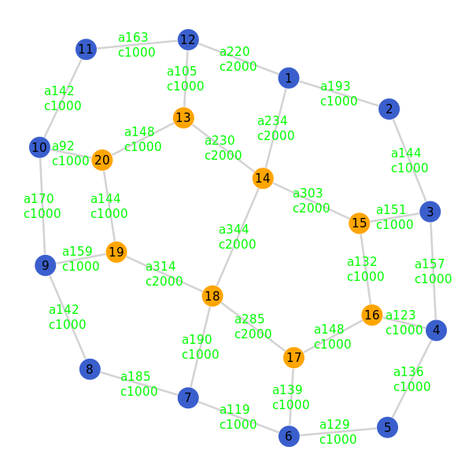

# Sprawozdanie [Lista nr 2](https://cs.pwr.edu.pl/bojko/2122_2lato/tss.html)

| Przedmiot  | Technologie sieciowe   |
| ---------- | ---------------------- |
| Prowadzący | Mgr inż. Dominik Bojko |
| Autor      | Maciej Bazela          |
| Indeks     | 261743                 |
| Grupa      | Czw. 15:15-16:55       |
| Kod grupy  | K03-76c                |

Kod źródłowy znajduje się w repozytorium na moim [githubie](https://github.com/Flowyh/ts2022).

#### 1. Wymagania

Celem tej listy było zaprojektowanie modelu sieci, oszacowanie jej niezawodności i zbadanie jak się ta wartość zmienia przy manipulowaniu wartościami parametrów wejściowych.

Za zadanie mieliśmy:

- zaproponować graf spójny ($|V| = 20, |E| < 30$, gdzie $|V|$ to liczba wierzchołkow, $|E|$ to liczba krawędzi) opisujący topologię sieci,
- ustalić macierz natężeń wysyłanych pakietów,
- zaproponować funkcje przepustowości $c$ oraz funkcję przepływu $a$, opisujące jak przechodzą pakiety pomiędzy wierzchołkami.

Następnie na podstawie zaproponowanego modelu mieliśmy oszacować wartość niezawodności sieci oraz pokazać jak się ona zmienia przy:

- zwiększaniu wartości macierzy natężeń,
- zwiększaniu wartości przepustowości krawędzi,
- dodawaniu nowych krawędzi do grafu.

#### 1.1 Środowisko

Do rozwiązania zadania wykorzystałem język [Julia](https://julialang.org/) oraz biblioteki: Graphs, GraphPlot, Compose, Cairo, Fontconfig.

Aby zainstalować powyższe biblioteki wystarczy w julia REPL wpisać poniższe komendy:

```julia
julia> using Pkg
julia> Pkg.add(Graphs)
julia> Pkg.add(GraphPlot)
julia> Pkg.add(Compose)
julia> Pkg.add(Cairo)
julia> Pkg.add(FontConfig)
```

#### 2. Model sieci

##### 2.1 Toplogia (graph)

Zaproponowaną przeze mnie topologią jest graf złożony z dwóch mniejszych grafów cyklicznych (8 i 12 węzłów). Wierzchołki obu tych grafów połączyłem w miarę regularny sposób, aby każdy z wierzchołków miał około 3 wychodzące krawędzie.

##### 2.2 Macierz natężeń (traffic)

Macierz natężeń $N = [n(i,j)]$, gdzie $n(i,j)$ jest liczbą pakietów przesyłanych w ciągu sekundy od źródła $v(i)$ do ujścia $v(j)$.

Wartości w mojej macierzy natężeń są asymetryczne.

Przykład wygenerowanej macierzy natężeń (maksymalna liczba pakietów $\lt 10$):
$
\begin{bmatrix}
0 & 6 & 1 & 3 & 4 & 9 & 5 & 2 & 2 & 4 & 9 & 1 & 7 & 7 & 3 & 8 & 2 & 3 & 2 & 9\\3 & 0 & 8 & 1 & 7 & 6 & 3 & 1 & 3 & 4 & 8 & 5 & 6 & 4 & 2 & 2 & 8 & 1 & 5 & 6\\9 & 8 & 0 & 9 & 4 & 2 & 5 & 3 & 9 & 5 & 6 & 7 & 7 & 1 & 4 & 3 & 2 & 6 & 3 & 9\\2 & 2 & 1 & 0 & 3 & 1 & 4 & 7 & 9 & 5 & 6 & 1 & 8 & 9 & 7 & 1 & 5 & 9 & 9 & 6\\1 & 5 & 7 & 1 & 0 & 8 & 4 & 1 & 5 & 3 & 2 & 6 & 1 & 9 & 3 & 9 & 7 & 7 & 1 & 5\\1 & 8 & 4 & 3 & 9 & 0 & 5 & 6 & 3 & 5 & 2 & 7 & 8 & 3 & 6 & 7 & 1 & 4 & 6 & 6\\3 & 7 & 1 & 8 & 2 & 1 & 0 & 3 & 6 & 8 & 3 & 9 & 5 & 8 & 7 & 4 & 1 & 6 & 5 & 5\\6 & 4 & 9 & 1 & 5 & 2 & 9 & 0 & 9 & 4 & 2 & 3 & 9 & 6 & 2 & 6 & 1 & 2 & 1 & 1\\9 & 2 & 5 & 5 & 3 & 9 & 4 & 2 & 0 & 2 & 8 & 6 & 6 & 9 & 3 & 7 & 1 & 5 & 5 & 4\\5 & 4 & 4 & 5 & 7 & 3 & 9 & 6 & 6 & 0 & 9 & 7 & 4 & 2 & 7 & 3 & 8 & 8 & 2 & 9\\8 & 1 & 4 & 6 & 3 & 1 & 9 & 8 & 1 & 1 & 0 & 8 & 9 & 2 & 3 & 2 & 4 & 3 & 4 & 4\\5 & 9 & 6 & 1 & 5 & 7 & 7 & 2 & 3 & 1 & 2 & 0 & 8 & 1 & 6 & 7 & 6 & 6 & 6 & 8\\8 & 8 & 6 & 9 & 7 & 1 & 9 & 2 & 1 & 7 & 5 & 1 & 0 & 2 & 4 & 7 & 3 & 2 & 3 & 4\\7 & 5 & 8 & 8 & 1 & 8 & 7 & 2 & 9 & 1 & 6 & 1 & 9 & 0 & 1 & 8 & 2 & 5 & 1 & 3\\7 & 2 & 6 & 5 & 9 & 6 & 5 & 2 & 5 & 1 & 8 & 4 & 3 & 2 & 0 & 7 & 4 & 4 & 8 & 7\\3 & 9 & 7 & 3 & 2 & 4 & 4 & 4 & 2 & 8 & 3 & 9 & 3 & 5 & 1 & 0 & 2 & 4 & 4 & 4\\9 & 3 & 1 & 4 & 3 & 8 & 1 & 7 & 8 & 5 & 3 & 9 & 1 & 7 & 1 & 3 & 0 & 2 & 3 & 5\\6 & 2 & 3 & 3 & 1 & 6 & 7 & 7 & 7 & 9 & 1 & 1 & 7 & 2 & 1 & 1 & 9 & 0 & 9 & 3\\1 & 5 & 3 & 4 & 5 & 6 & 7 & 2 & 5 & 4 & 7 & 4 & 4 & 6 & 9 & 2 & 7 & 8 & 0 & 8\\7 & 2 & 2 & 4 & 2 & 3 & 6 & 4 & 7 & 3 & 8 & 9 & 5 & 6 & 3 & 5 & 2 & 9 & 7 & 0
\end{bmatrix}
$

##### 2.3 Funkcja przepływu (flow)

Funkcja przepływu zadana jest wzorem:

$a(e)=\sum_{i=1}^{|V|} \sum_{j=1}^{|V|} [|e\in{P(i,j)}|] n (i,j)$,

gdzie:
$P(i,j)$ to zbiór wszystkich krawędzi najkrótszej ścieżki z wierzchołka $v(i)$ do $v(j)$.
$[|e \in{A}|]$ oznacza indykator zbioru $A$, tj. $1$ tam, gdzie $e \in{A}$, a $0$ w przeciwnym przypadku.

##### 2.4 Funckja przepustowości (bandwidth)

Zamiast podawać wielkość pakietu w bajtach i przeskalowywać wszystko na bity, postanowiłem, że przyjmę stałą liczbę pakietów wysyłanych przez łącze o przepustowości $1$ $Mb/s$. Oznaczmy tą stałą jako $b$.

Wyliczanie przepustowości dla danej krawędzi będzie polegać na wyliczeniu najmniejszej całkowitej liczby $n$ $Mb/s$ potrzebnych, aby móc przesłać obecnie liczbę pakietów równą przepływowi krawędzi.

Wynik przemnożę przez jakąś stałą $s$, aby mieć trochę swobody przy badaniu niezawodności sieci.

Funkcja przepustowości zadana jest wzorem:

$c(e) = s\cdot\lceil{\frac{a(e)}{b}}\rceil$

Do testów przyjąłem wartości:

- $b = 1000$ (czyli dla $1$ $Mb/s$ pakiet ma 1000 bitów),
- $s = 5$.

Uwaga: kiedy zwiększamy wielkość pakietu w sieci, tak naprawdę zmniejszamy stałą $b$, na przykład:

- dwukrotne zwiększenie wielkości pakietu: $\frac{b}{2}$, czyli pakiety mają teraz po 2000 bitów etc.


_Rysunek 1. Model sieci o zadanej topologii, wartościach macierzy natężeń i wyliczonych funkcjach przepływu i przepustowości, a = przepływ (flow), c = przepustowość (bandwidth)_

#### 3. Testy

##### 3.1 Niezawodność sieci

Za badaną statystykę przyjmujemy szacunkową wartość niezwodności sieci.

Niezawodność zależna jest od kilku parametrów:

- $T_{max}$ - maksymalne opóźnienie pakietu,
- $1 - p$ - prawdopodobieństwo uszkodzenia sieci,
- m - wielkość pakietu, zmnieszająca stałą b _(patrz: 2.4)_.

Wyliczamy ją według następującego algorytmu:

- 1. Dla k powtórzeń
  - 1.1. Dla każdej z krawędzi w danej sieci
    - 1.1.2. Wylosuj jednostajnie liczbę rand z przedziału [0, 1)
    - 1.1.3. Jeśli p < rand, usuń obecną krawędź
  - 1.2. Jeśli nowo powstały graf nie jest spójny, przerwij iterację
  - 1.3. Dla każdej z krawędzi danej sieci
    - 1.3.1. Jeśli $\frac{c(e)}{m} < a(e)$ - krawędź jest zapchana, przerywamy iterację
  - 1.4 Policz średnie opóźnienie sieci ze wzoru:
    - $T = \frac{1}{|N|}\cdot\sum_{e\in{E}}\frac{a(e)}{\frac{c(e)}{m} - a(e)}$, gdzie $|N|$ to suma wartości z macierzy natężeń
  - 1.5 Jeśli $T < T_{max}$ dane powtórzenie jest sukcesem
- 2. Zwróć średnią arytmetyczną liczby sukcesów dla k powtórzeń.

Pseudokod:

```
  function networkReliability(net, T_max, p, m, k)
    successes <- 0
    repeat k times
      for edge in edges(net)
        if (p < random(U[0,1)))
          remove_edge(edge)
      if (net.graph is not connected) continue
      for edge in edges(net)
        if (c[edge] / m < a[edge])
          break
      T <- averagePacketDelay(net)
      if (T < T_max) successes <- successes + 1
    return successes / k
```

##### 3.2 Przebieg testów

Dla wybranego przypadku zmieniałem 3 wartości przyjmowane przez algorytm wyliczający niezawodność sieci: prawdopodobieństwo nieuszkodzenia ($p$) krawędzi, maksymalne opóźnienie, wielkości pakietów w sieci oraz $step$, czyli "o ile" zwiększamy dany parametr podczas testu.

W teście niezawodności przyjąłem stałą wartóść powtórzeń równą $100$.

Dla danego rodzaju testu wykonywałem:

- k powtórzeń testu
- testy dla dziesiątych części $T_{max}$ ($[0.1T_{max}, 0.2T_{max},...,1T_{max}]$)
- testy dla dziesiątych części wartości $step$
- liczyłem niezawodność sieci ($100$ powtórzeń),

czyli łącznie dla każdego testu liczyłem $10000k$ razy oszacowanie niezawodności sieci, co według mnie jest wystarczającą próbką, pozwalającą na wyciągnięcie sensownych wniosków z przeprowadzonych badań.

##### 3.3 Obserwacje

W przypadku wszystkich rodzajów zadanych testów, można zauważyć te same tendencje:

- im wyższe $T_{max}$ lub $p$, tym większa wartość niezawodności sieci,
- dla większych rozmiarów pakietów, wartość niezawodności sieci maleje.

Wyniki moich testów znajdują się w folderze ./jsons.

Z nazw plików, możemy odczytać dla jakich parametrów wykonywaliśmy dany test:

- `bandwidthTest-t0.006-p0.9-m2-s0.1-k10-2022-04-06T19:33:31.845.json` - wyniki testu polegającego na zwiększaniu przepustowości sieci, dla $T_{max}$ od $0.0006$ do $0.006$ (inkrementując co $10\%$ wartości $T_{max}=0.006$), dla $p=0.9$, wielkości pakietów równej $m=2$, $step = 0.1$, dalej data w formacie ISO 8601.

Dla innych testów mamy nazwy:

- `trafficTest[...].json` - wyniki testu polegającego na zwiększaniu wartości macierzy natężeń,
- `newEdgeTest[...].json` - wyniki testu polegającego na dodawaniu nowych krawędzi.

##### 3.3.1 Zwiększanie liczby pakietów

Podczas testu zwiększałem wartości macierzy natężeń o $100\% \cdot step$.

Czyli przykładowo dla $step=0.1$ przemnażałem wszystkie liczby o $1.1$ ($110\%$).

W przeprowadzonych badaniach przyjąłem $step$ od $0.1$ do $1.0$, inkrementując co $0.1$.

##### Wykresy

- zmiana $p$:

  

  

  

- zmiana wielkości pakietu:

  

  

Im więcej pakietów przesyłamy w sieci, tym większa szansa na "zator" krawędzi - liczba przesyłanych pakietów jest większa od przepustowości, co skutkuje utratą niektórych pakietów.

##### 3.3.2 Zwiększenie przepustowości krawędzi

Tak samo jak w przypadku zwiększania liczby pakietów, dla każdej krawędzi w danym modelu sieci zwiększałem przepustowości o dany $100\%\cdot step$.

W przeprowadzonych badaniach przyjąłem $step$ od $0.1$ do $1.0$.

##### Wykresy

- zmiana $p$:


- zmiana wielkości pakietu:


Im większa przepustowość tym więcej pakietów możemy przesłać przez krawędź. Dzięki temu mamy mniejsze opóźnienie pomiędzy krawędziami, a co za tym idzie, lepsza niezawodność.

##### 3.3.3 Dodawnie nowych krawędzi

W przypadku tworzenia nowych połączeń pomiędzy wierzchołkami wykorzystałem te same wartości $step$ co w poprzednich testach. Po prostu przemnożyłem $step$ przez $10$.

W kolejnych iteracjach dodawałem $1$ krawędź, $2$ krawędzie, $3$ , ..., aż do maksymalnie $10$ krawędzi.

##### Wykresy

- zmiana $p$:


- zmiana wielkości pakietu:


Dodawanie nowych krawędzi pozwala na znajdywanie szybszych ścieżek pomiędzy wierzchołkami, a co za tym idzie, na zwiększenie niezawodności badanego modelu.
