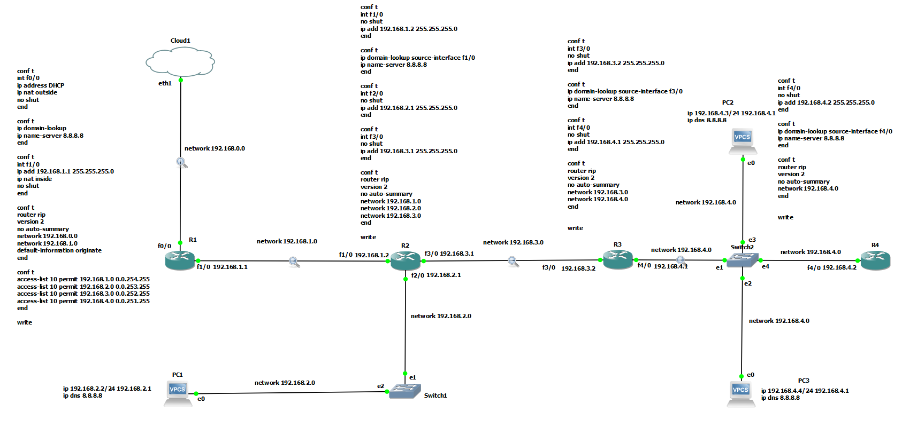
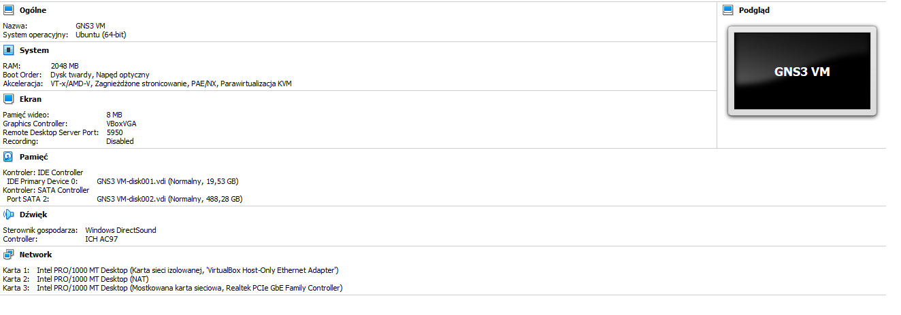
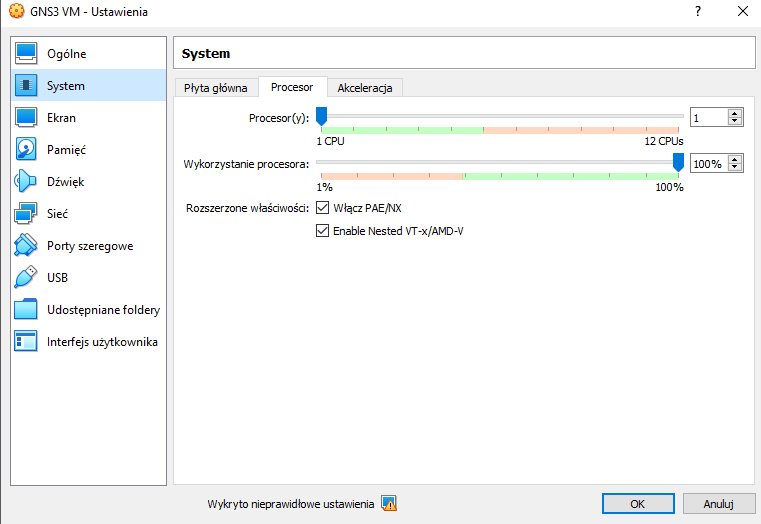
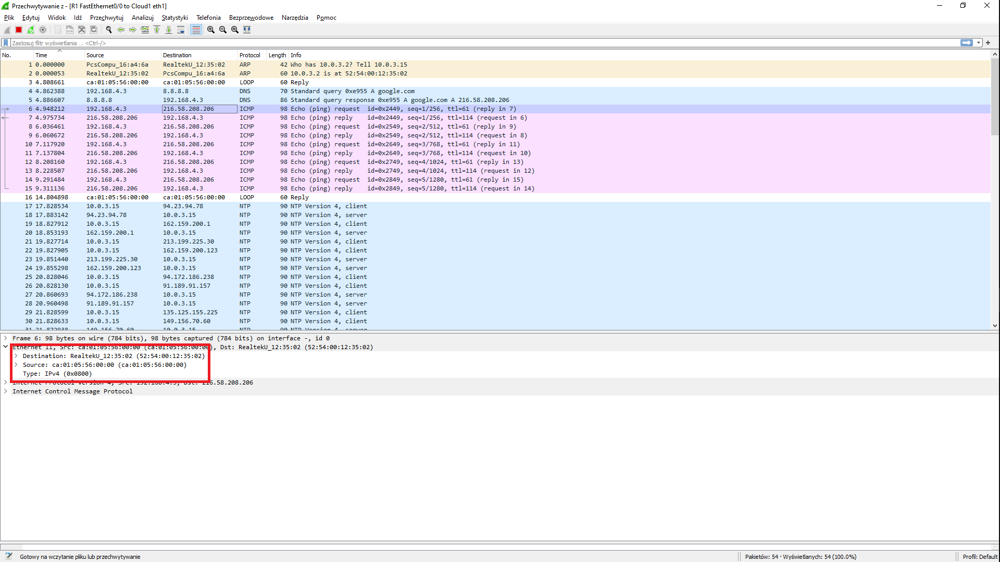
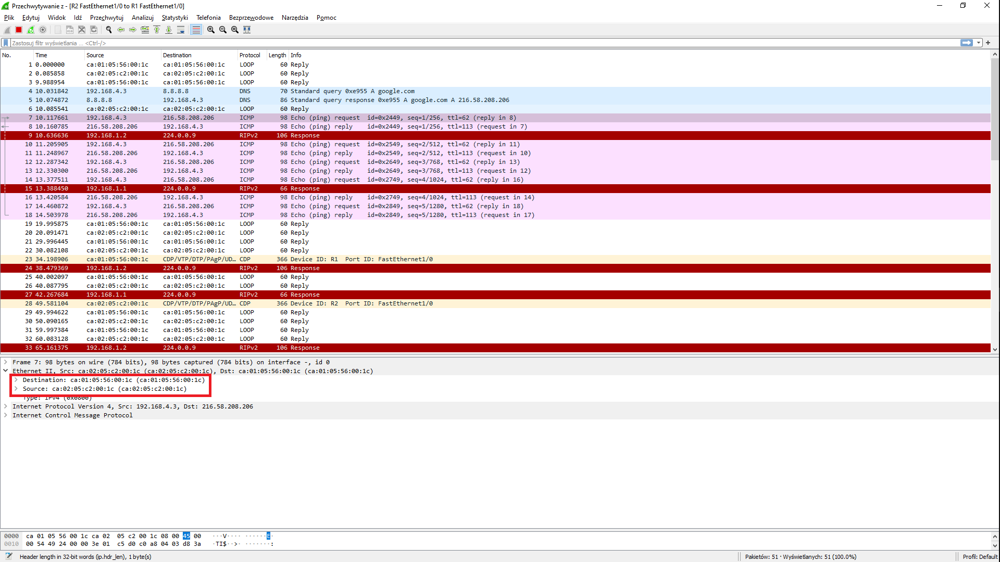
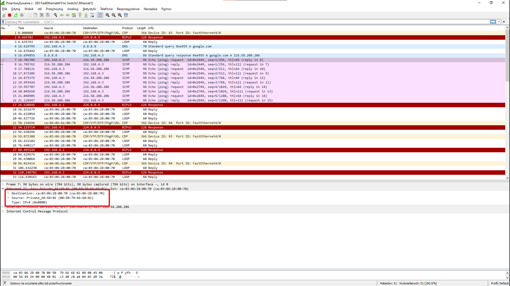
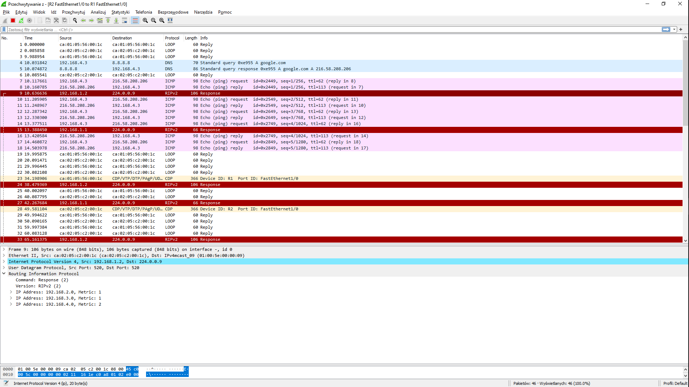

# Sprawozdanie [Lista nr 4](https://cs.pwr.edu.pl/bojko/2122_2lato/tss.html)

| Przedmiot  | Technologie sieciowe   |
| ---------- | ---------------------- |
| Prowadzący | Mgr inż. Dominik Bojko |
| Autor      | Maciej Bazela          |
| Indeks     | 261743                 |
| Grupa      | Czw. 15:15-16:55       |
| Kod grupy  | K03-76c                |

#### 1. Wymagania

Celem zadania było skofigurowanie sieci wirtualnej o podanej topologii w symulatorze GNS3, tak aby:

- sieć była podłączona do zewnętrznej, fizycznej sieci 'Cloud',
- router bezpośrednio był połączony z siecią 'Cloud' uzyskiwał z niej dynamiczny adres IP,
- pozostałe urządzenia posiadały statyczny adres IP w swoich sieciach,
- możliwe było wysyłanie komunikatów "ping" pomiędzy dowolną parą urządzeń oraz na adres zewnętrzny.

Następnie należało ustawić sniffowanie pakietów (za pomocą WireSharka) na niektórych fragmentach sieci oraz przeanalizować przechwycone komunikaty po wysłaniu zapytania "ping google.com" z jednego z urządzeń.

#### 1.1 Środowisko

Graphical Network Simulator 3 (w skrócie GNS3) jest emulatorem, dzięki któremu możemy symulować działanie stworzonej przez nas topologii sieci.

Aby poprawnie korzystać z GNS3, trzeba odpowiednio przygotować kilka innych narzędzi:

- Virtual Box wraz z obrazem GNS3 VM - aby móc wirtualizować serwer oraz podpięte w symulacji urządzenia,
- obraz routera, w moim przypadku wykorzystałem router [Cisco 7200](https://www.gns3.com/marketplace/featured/cisco-7200)) (właściwy obraz routera pojawił się magicznie na moim dysku!),
- PuTTy - klient ssh/telnet pod windowsem.

#### 2. Konfiguracja sieci


_Rysunek 1. Topologia sieci._

Trzeba odpowiednio skonfigurować każde z podanych urządzeń oraz uruchomić maszynę wirtualną symulującą połączenie 'Cloud'.


_Rysunek 2. Specyfikacje maszyny wirtualnej GNS3._

Ważne jest, aby dobrze skonfigurować karty sieciowe maszyny wirtualnej. Oprócz kart "VBox host-only" oraz NAT trzeba także podpiąć mostkowaną kartę sieciową, która bezpośrednio wskazuje na faktyczną kartę w komputerze. W moim przypadku była to karta Realtek PCIe GbE Family Controller (karta sieciowa ethernet).

Według dokumentacji GNS3 **odradza się korzystania z karty sieciowej WI-FI**.



Dodatkowo ważne jest zaznaczenie opcji Nested VT-x/AMD-V, aby można było emulować maszyny wirtualne (w maszynie wirtualnej) odpowiadające urządzeniom dodawanym do naszej topologii.

##### 2.1 Komendy potrzebne do konfiguracji routerów

Aby poprawnie zasymulować działanie routerów Cisco 7200 trzeba ręcznie skonfigurować przypisywanie IP do odpowiednich interfejsów, do jakiego DNS ma się odwoływać, protokół RIPv2 etc.

Poniżej jest opis użytych przeze mnie komend. Wszystkie polecenia kończymy komendą write, aby móc zapisać konfiguracje w pamięci flash routera.

##### Router brzegowy (R1)

Przypisanie dynamicznego adresu ip do routera brzegowego:

```sh
conf t # rozpoczęcie bloku konfiguracyjnego
int f0/0 # wybranie interfejsu f0/0
ip address DHCP # dynamiczny adres IP
ip nat outside # tłumaczy źródło IP pakietów z zewnątrz do wewnątrz oraz tłumaczy IP celu pakietów z wewnątrz na zewnątrz
no shut # uruchamia interfejs
end # zakończenie bloku konfiguracyjnego
```

Ustawienie serwera DNS:

```sh
conf t
ip domain-lookup
ip name-server 8.8.8.8 # ustawiamy domyślny DNS jako 8.8.8.8 (dns od google)
end
```

Protokół RIPv2:

```sh
conf t
router rip # oznaczenie protokołu rip
version 2 # wersja protokołu rip
no auto-summary # wyłącza podsumowywanie dróg pomiędzy routerami (bo inaczej mogłyby być konflikty przy podsieciach)
network 192.168.0.0 # jakie sieci obejmuje router
network 192.168.1.0
default-information originate # ustawia domyślną ścieżkę do sieci zewnętrznej
end
```

Ustawienie listy filtrującej:

```sh
conf t
access-list 10 permit 192.168.1.0 0.0.254.255
access-list 10 permit 192.168.2.0 0.0.253.255
access-list 10 permit 192.168.3.0 0.0.252.255
access-list 10 permit 192.168.4.0 0.0.251.255 # zezwala adresom z sieci 192.168.1.0-192.168.4.0 na przesyłanie pakietów z zewnątrz i wewnątrz
end
```

##### Inne routery:

Dla innych routerów ustawiamy po kolei wybrane IP dla każdego interfejsu (dla każdej podłączonej do routera sieci), ustawiamy domain-lookup, aby przekazywany był do routera brzegowego oraz protokół RIPv2, tak samo jak w routerze brzegowym.

Przykład dla R2:

```sh
conf t
int f1/0
no shut
ip add 192.168.1.2 255.255.255.0
end

conf t
ip domain-lookup source-interface f1/0
ip name-server 8.8.8.8
end

conf t
int f2/0
no shut
ip add 192.168.2.1 255.255.255.0
end

conf t
int f3/0
no shut
ip add 192.168.3.1 255.255.255.0
end

conf t
router rip
version 2
no auto-summary
network 192.168.1.0
network 192.168.2.0
network 192.168.3.0 # mamy teraz 3 sieci
end
```

##### Ustawienie komputerów wirtualnych

Konfiguracja komputerów wirtualnych jest bardzo prosta. Wystarczy przypisać komputerowi adres IP w jego podsieci, zaznaczyć jaką ma maskę używać, w jakiej sieci się znajduje i do jakiego DNS ma się odwoływać:

Np. dla PC1:

```sh
ip 192.168.2.2/24 192.168.2.1 # 192.168.2.2 to adres komputera /24 oznacza ile bitów tworzy adres
ip dns 8.8.8.8 # ustawnia DNS na 8.8.8.8
```

##### Ustawienie switchów

Poza podpięciem switcha do odpowiedniego routera i podłączeniu do niego urządzeń, nie trzeba nic konfigurować :).

#### 3. Rozsyłanie pakietów po sieci

Po poprawnym podłączeniu i skonfigurowaniu wszystkich urządzeń w sieci, możemy sprawdzić czy wszystko się dobrze w niej rozsyła.


_Rysunek 3. Ping na onet.pl z R1._


_Rysunek 4. Pingi na inne urządzenia z R1._

Oczywiście inne urządzenia (poza R1), także się ze sobą komunikują:


_Rysunek 5. Pingi na inne urządzenia z R1._

PC3:

_Rysunek 6. Ping na google.com z PC3._

Jak widać, do komputerów poprawnie przypisywane są adresy IP, DNS, MAC oraz adresy gatewayów.

#### 4. Rozchodzenie się pakietów po sieci

Ustawiłem przechwytywanie pakietów od Cloud do R1, od R1 do R2, od R2 do R3 i od R3 do switcha, do którego podpięty jest komputer PC2. Następnie uruchomiłem polecenie ping na domenę google.com i sprawdziłem jak pakiety rozchodzą się po mojej sieci.


_Rysunek 7. Przechwytywanie od R1 do Cloud._


_Rysunek 8. Przechwytywanie od R2 do R1._


_Rysunek 9. Przechwytywanie od switch2 do R3._

Na czerwono zaznaczyłem jak kolejno zmienia się destination i source każdego pakietu ICMP. Gdy PC2 zaczyna pingować google.com, musi najpierw wysłać wszystkie ramki przez R3. Dlatego w ostatnim zrzucie ekranu możemy zobaczyć, że źródło tych pakietów jest prywatne (MAC komputera), a cel ustawiony jest na adres MAC routera R3.

Potem w routerze R3 ramki są odpakowywane i przepakowywane na nowy destination i source (akurat R2-R3 mi się gdzieś zapodziało, ale widać to dla R2-R1). Nowym sourcem jest router, z którego jest przekazywany dalej pakiet, a destination będzie następny po drodze router.

Na samym końcu na trasie R1-Cloud widać, że finalnym celem jest RealtekU, czyli moja karta sieciowa ethernet. Stamtąd wszystko pójdzie dalej, aż do serwera o adresie IP przypisanym do domeny google.com.

##### Inne pakiety

Poza pakietami ICMP, warto też wspomnieć o innych pakietach, które przesyłane są po sieci:

- pakiety DNS - każde zapytanie na adres zewnętrzny musi poznać docelowy adres IP. Dlatego przed przesłaniem pakietu na początku jest wysyłane query do serwera dns (w naszym przykadu 8.8.8.8) i jeśli domena zostanie poprawnie znaleziona, odsyłany jest adres IP z powrotem do urządzenia pytającego:


_Rysunek 10. Zapytanie do DNS._


_Rysunek 11. Odpowiedź od DNS._

- pakiety ARP (address resolution protocol) - pakiety protokołu umożliwiającego mapowanie logicznych adresów warstwy sieciowej na fizyczne adresy łącza danych:


_Rysunek 11. ARP, kto ma adres 10.0.3.2? Powiedz to 10.0.3.15._


_Rysunek 12. ARP, 10.0.3.2 ma adres MAC 52:54:00:12:35:02._

- pakiety RIP - pakiety rozsyłane przez routery RIP, służące do tworzenia route tables i przekazywania informacji dotyczących odległości (w sensie liczby skoków) pomiędzy danymi urządzeniami:


_Rysunek 13. Pakiet protokołu RIP dla 192.168.1.2._
