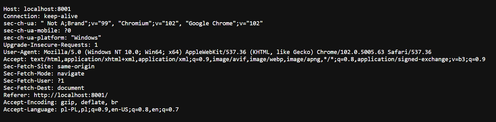
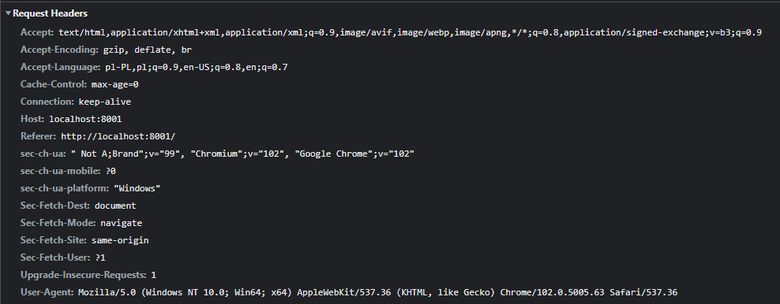
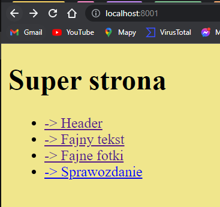
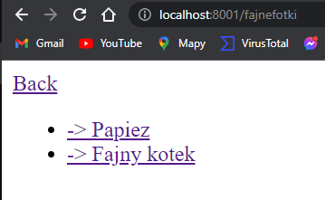
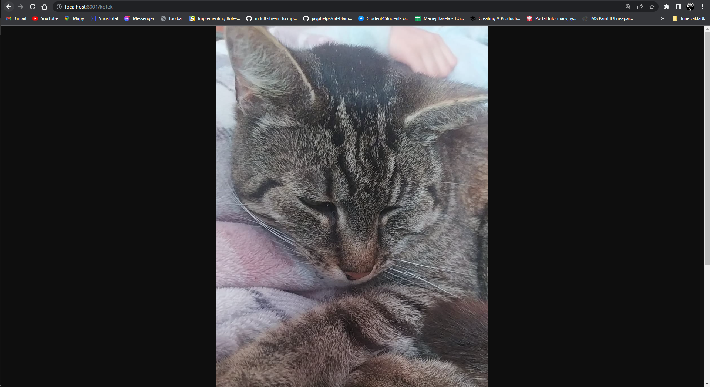
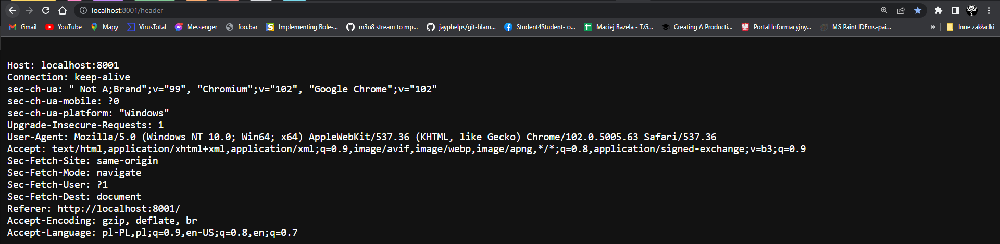
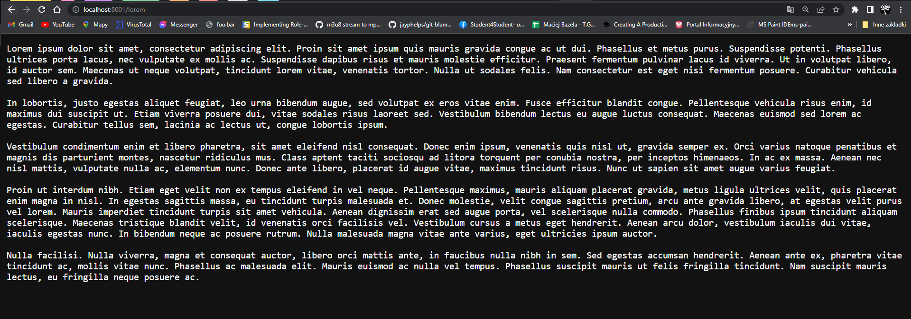
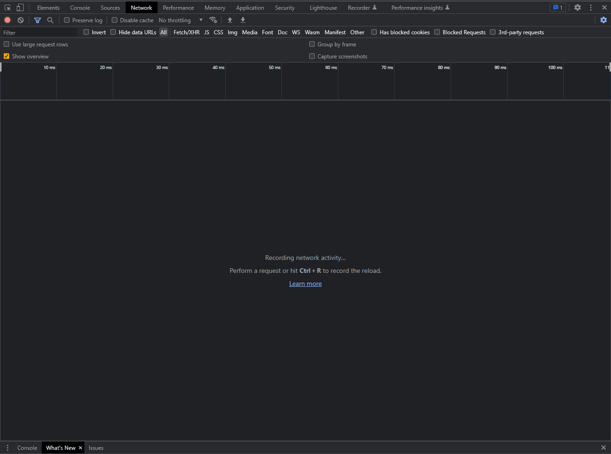
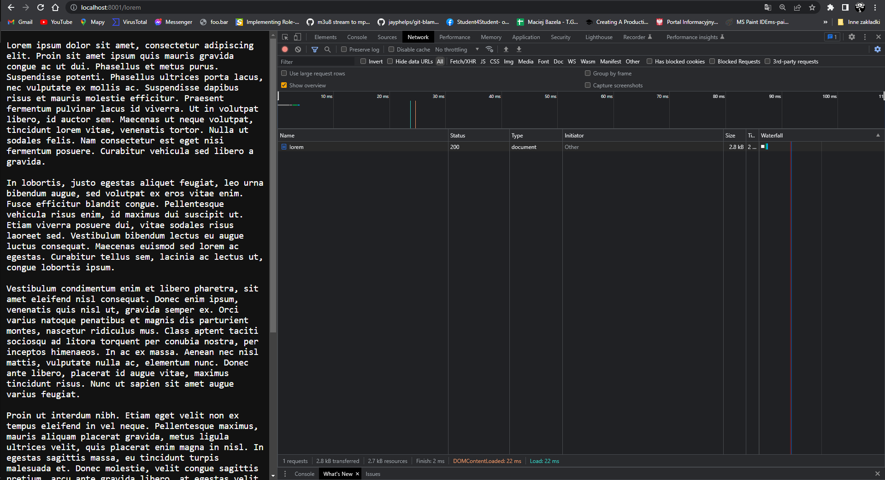
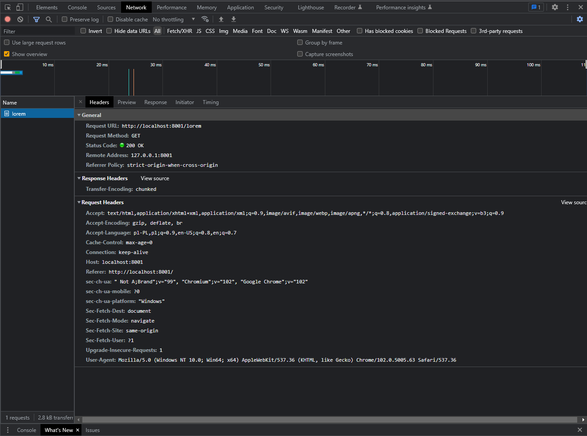

# Sprawozdanie [Lista nr 5](https://cs.pwr.edu.pl/bojko/2122_2lato/tss.html)

| Przedmiot  | Technologie sieciowe   |
| ---------- | ---------------------- |
| Prowadzący | Mgr inż. Dominik Bojko |
| Autor      | Maciej Bazela          |
| Indeks     | 261743                 |
| Grupa      | Czw. 15:15-16:55       |
| Kod grupy  | K03-76c                |

Sprawozdanie znajduje się w repozytorium na moim [githubie](https://github.com/Flowyh/ts2022).

#### 1. Wymagania

Na podstawie załączonego skryptu należy:

- uruchomić go i zastanowić się jak działa serwer,
- połączyć się do niego przy użyciu przeglądarki internetowej,

Napisać własny serwer oraz:

- wysyłać do klienta nagłówek jego żądania
- obsługiwać żądania klienta do prostego tekstowego serwisu WWW (kilka statycznych ston z wzajemnymi odwołaniami) zapisanego w pewnym katalogu dysku lokalnego komputera na którym uruchomiony jest skrypt serwera,
- przechwycić przesyłane/przychodzące komunikaty za pomocą analizatora sieciowego (F12)

#### 1.1 Środowisko

Do napisania serwera użyłem kombinacji języka programowania HTML oraz lekko gorszego Julia.

#### 2. Analiza skrytpu server.pl

```perl
  use HTTP::Daemon;
  use HTTP::Status;
  #use IO::File;

  my $d = HTTP::Daemon->new(
           LocalAddr => 'lukim',
           LocalPort => 4321,
       )|| die;

  print "Please contact me at: <URL:", $d->url, ">\n";


  while (my $c = $d->accept) { # 1)
      while (my $r = $c->get_request) { # 2)
          if ($r->method eq 'GET') {

              $file_s= "./index.html";    # index.html - jakis istniejacy plik
              $c->send_file_response($file_s);

          }
          else {
              $c->send_error(RC_FORBIDDEN)
          }

      }
      $c->close;
      undef($c);
  }
```

W załączonym do listy pliku znajduje się prosta implementacja serwera HTTP.

Przy uruchomieniu go włączany jest serwer daemon na adresie lukim i porcie 4321.

W pętli 1) sprawdzamy, czy serwer może akceptować połączenia od klienta (dopóki może akceptować, wykonuj).

W pętli 2) Odbierane jest przychodzące żądanie od klienta z metodą **GET**. W odpowiedzi wysyłany jest statyczny plik **index.html**, który może być wyświetlony w przeglądarce.

Jeśli zapytanie nie jest **GET** odsyłany jest error **403 Forbidden**.

Kiedy klient nie wysyła już żądań, zamykamy jego połączenie i dereferujemy zmienną **$c**.

Będąc całkowicie szczery, nie włączałem tego skryptu, bo nigdy nie korzystałem z Perla, ale całkiem łatwo się domyśleć, o co tu chodzi.

#### 3. Lepszy serwer w Julii

Napisałem podstawowy serwer z użyciem biblioteki HTTP w Julii:

```julia
using HTTP, Sockets

const ROUTER = HTTP.Router()

# Zmień skrypt (lub napisz własny serwer w dowolnym języku programowania) tak aby wysyłał do klienta nagłówek jego żądania.
println("Server running on port 8001 . . .")

function print_header(header)
  result = ""
  for pair in header
    result *= "$(pair[1]): $(pair[2])\n"
  end
  return result
end
HTTP.@register(ROUTER, "GET", "/header", req->HTTP.Response(200, "\n$(print_header(HTTP.Messages.headers(req)))"))

# Zmień skrypt (lub napisz własny serwer w dowolnym języku programowania)
# tak aby obsugiwał żądania klienta do prostego tekstowego serwisu WWW
# (kilka statycznych ston z wzajemnymi odwołaniami) zapisanego w pewnym katalogu dysku lokalnego komputera na którym uruchomiony jest skrypt serwera.
HTTP.@register(ROUTER, "GET", "/", req->HTTP.Response(read("./index.html")))
HTTP.@register(ROUTER, "GET", "/papuez", req->HTTP.request("GET", "https://media.discordapp.net/attachments/868291982768894013/889955128252178512/papiez_call_me.gif"))
HTTP.@register(ROUTER, "GET", "/fajnefotki", req->HTTP.Response(read("./fajne_fotki.html")))
HTTP.@register(ROUTER, "GET", "/kotek", req->HTTP.Response(read("./kotekasi.jpg")))
HTTP.@register(ROUTER, "GET", "/lorem", req->HTTP.Response(read("./lorem")))
HTTP.@register(ROUTER, "GET", "/bye", req->HTTP.Response(200, "Bye!"))
HTTP.@register(ROUTER, "GET", "/*", req->HTTP.Response(404, "Not found!"))
HTTP.serve(ROUTER, Sockets.localhost, 8001)
```

Na samym początku działania tworzony jest obiekt ROUTER, który odpowiada za przekierowanie żądań na dane adresy na odpowiednie pliki html/txt/jpg.

Na przykład, zapytania **GET** na _localhost:8001/fajnefotki_ zwróci w odpowiedzi plik _fajne_fotki.html_.

Każda taka ścieżka musi zostać zarejestrowana w naszym routerze poprzez użycie _HTTP.@register_.

Na samym końcu uruchamiamy serwer z routerem **ROUTER** na adresie **localhost** na porcie **8001**.

#### 3.1 Zwracanie headera użytkownikowi

Aby podpatrzyć nagłówek żądania HTTP Julii trzeba wywołać funkcję **HTTP.Messages.headers()** na obiekcie **req** (request - żądanie).

Funkcja ta zwraca słownik _SubString_ => _SubString_, więc napisałem prosty parser, który zapisuje "pole nagłówka: wartość" do Stringa i zwracam go klientowi jako odpowiedź na żądanie.


_Rysunek 1. Przykład odesłania headera do klienta._


_Rysunek 2. Rzeczywisty nagłówek (zgadza się z tym co odsełałem)._

Opis wszystkich wartości nagłówka:

```
Accept: text/html,application/xhtml+xml,application/xml;q=0.9,image/avif,image/webp,image/apng,*/*;q=0.8,application/signed-exchange;v=b3;q=0.9
// Opisuje jakie typy danych możemy przesłać do klienta

Accept-Encoding: gzip, deflate, br
// Opisuje jakie typy kodowania możemy używać przy rozmowie z klientem

Accept-Language: pl-PL,pl;q=0.9,en-US;q=0.8,en;q=0.7
// Opisuje preferencje językowe klienta

Cache-Control: max-age=0
// Zawiera dyrektywy kontrolujące proces cachingu przeglądarki
// Tutaj informacja max-age=0 oznacza, że po 0 sekundach przekazana w żądaniu informacja staje się przedawniona (remains "fresh" for 0 seconds)

Connection: keep-alive
// Kontroluje sposób połączenia klient-serwer, keep-alive oznacza, że połączenie ma być trwałe i niezamykane

Host: localhost:8001
// Host i port serwera, na który jest wysyłane żądanie

Referer: http://localhost:8001/
// Zawiera cały/część adres/u strony, z której wysłano żądanie do serwera

sec-ch-ua: " Not A;Brand";v="99", "Chromium";v="102", "Google Chrome";v="102"
// "User agent hint" -> zawiera branding user-agenta (niżej wyjaśnione co to jest) i informacje o wersjach komponentów przeglądarki.

sec-ch-ua-mobile: ?0
// ?0 - użytkownik nie jest na urządzeniu mobilnym
// ?1 - użytkownik jest na urządzeniu mobilnym

sec-ch-ua-platform: "Windows"
// Jaki system/platformę wykorzystuje użytkownik?

Sec-Fetch-Dest: document
// Wskazuje cel żądania (o co prosimy? o dokument)

Sec-Fetch-Mode: navigate
// Wskazuje tryb żądania

Sec-Fetch-Site: same-origin
// Wskazuje czy żądanie przyszło z tej samej domeny czy nie (same-origin - ta sama domena, cross-site - żądanie z zewnętrznej strony)

Sec-Fetch-User: ?1
// Żądanie zostało wykonane bezpośrednio przez użytkownika

Upgrade-Insecure-Requests: 1
// Wysyła informację do serwera, która oznacza, że klient preferuje szyfrowanie i uwierzytelnianie odpowiedzi

User-Agent: Mozilla/5.0 (Windows NT 10.0; Win64; x64) AppleWebKit/537.36
(KHTML, like Gecko) Chrome/102.0.5005.63 Safari/537.36
// Pozwala serwerom rozpoznać aplikację, system operacyjny, vendor oraz wersje z których korzysta użytkownik
```

#### 3.2 Prosty serwis WWW

Zaprojektowałem prostą stronę w języku programowania HTML, która zawiera parę linków do innych plików na moim dysku:


_Rysunek 3. Super strona._

Zamieszczone linki prowadzą np. do zadania ze zwracaniem headera, do podstrony zawierającej linki do fajnych zdjęć (fotek) i jakiś przykładowy tekst (lorem ipsum), aby pokazać, że można odsyłać plain text:


_Rysunek 4. Fajne fotki._


_Rysunek 5. Fajny kotek._


_Rysunek 6. Zadanie z headerem._


_Rysunek 7. Lorem._

#### 3.3 Analizator sieciowy

Po nacisnięciu F12 uruchamia się następujące narzędzie:


_Rysunek 8. Dev tools w Google Chrome._

Służy ona jako narzędzie developerskie, a przydaje się szczególnie do wyłapywania wysyłanych/odbieranych żądań na danych stronach.

Aby poprawnie jej użyć, trzeba przełączyć się na karte _Network_, zaznaczyć przechwytywanie na _All_ i odświeżyć stronę.

Kiedy to zrobimy, zobaczymy przepływ komunikatów:


_Rysunek 9. Widok na requesty._


_Rysunek 10. Szczegóły danego żądania._

Możemy dokładnie odczytać każde pole naszego żądania i zwróconej odpowiedzi.

Request headers jest opisane wyżej, natomiast poza response headerem pojawia się szereg dodatkowych informacji:

```
Request URL: http://localhost:8001/lorem
// Na jaki URL przyszło żądanie

Request Method: GET
// Jaka jest metoda żądania?

Status Code: 200 OK
// Jaki jest status (kod statusu) odpowiedzi na żądanie
// 200 - wszystko jest OK

Remote Address: 127.0.0.1:8001
// Adres serwera (localhost:8001)

Referrer Policy: strict-origin-when-cross-origin
// Kontroluje ilość informacji przesyłanej w headerze Referer
```

W Response headerze znajduje się informacja co zostało zwrócone: chunked plik (czyli po prostu przekazaliśmy plik z serwera do klienta).

Normalnie byłoby tu dużo więcej informacji, jak na przykład informacje o cachingu, serwerze, customowe nagłówki etc.

Na innych stronach mojego "serwisu" żądania wyglądają praktycznie tak samo.

Dodatkowo, nad podanymi informacjami znajduje się oś czasu, która liczy czas w ms od załadowania strony. Można na niej podpatrzeć kiedy przesłano dane żądanie.

W zakładce previews można zobaczyć (jak można się domyślić) podgląd przesłanej informacji, response zawiera np. kod, w przypadku kiedy przesyłamy np. plik .html.
